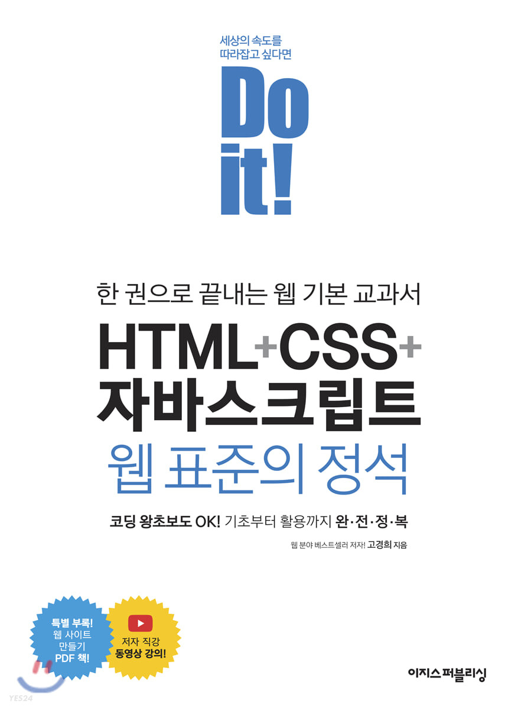

# Front_End_Examples
프론트 엔드 공부하기
### 개발 환경
####  사용한 IDE    intellij

### 참고 문헌
### 1. HTML + CSS

**Do it! HTML+CSS+자바스크립트 웹 표준의 정석
 고경희 지음 | 이지스 퍼블리싱**

### 2. javscript

**웹 프로그래밍을 위한 자바 스크립트 기본 편 고경희 지음 | 이지스 퍼블리싱 | 초판 3쇄 2020.06.15 발행**

*https://github.com/funnycom/js-basic-book.git
 예제 코드 출처*