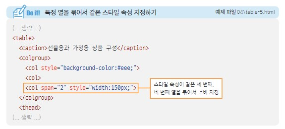

# 04-3 표 만들기

## 표의 구성 요소 알아보기

표<sup>table</sup>는 행<sup>row</sup>과 열<sup>column</sup> 그리고 셀<sup>cell</sup>로 이루어집니다<br>
표, 행, 열을 만드는 태그가 필요

## 표를 만드는 ```<table>, </table>```태그

표의 시작과 끝을 알려주는 태그
표의 제목을 붙이고 싶다면 ```<caption>```태그 사용

```html

<table>
    <caption>표 제목</caption>
</table>
```

## 행을 만드는 ```<tr>```태그, 셀을 만드는 ```<td>,<th>```태그

```<table>```태그 안에 행과 열을 지정
```<tr>```태그는 행을 만듦
```<td>```태그는 행 안의 셀을 만듦

### 예제

```html

<table>
    <tr>
        <td>1행 1열</td>
        <td>1행 2열</td>
    </tr>
    <tr>
        <td>2행 1열</td>
        <td>2행 2열</td>
</table>
```

### 출력 확인

<details>
<summary>👉눌러줘!👈</summary>

<div>
    <table>
    <tr>
        <td>1행 1열</td>  
        <td>1행 2열</td> 
    </tr>
    <tr>
        <td>2행 1열</td> 
        <td>2행 2열</td> 
    </table>
</div>
</details>

### ```<th>```태그 표의 제목행에 셀 만들기

```<th>```태그를 사용하면 진하게, 중앙에 표시됨

## 표의 구조를 지정하는 ```<thead>, <tbody>,<tfoot>```태그

태그의 't'는 table의미<br>
제목<sup>head</sup>, 본문<sup>body</sup>, 요약<sup>foot</sup><br>
<br>
자바 스크립트를 이용해```<tbdoy>```태그만 스크롤하도록 만들 수도 있음<br>
표의 구조는 웹 브라우저 화면에서는 보이지 않음

## 행이나 열을 합치는 ```<rowspan>, <colspan>```속성

행을 합치려면 ```<rowspan>```<br>
열을 합치려면 ```<colspan>```<br>
몇개의 셀을 합칠지 지정 가능<br>

```html
<td rowspan="합칠 셀의 개수">셀의 내용</td>
<td colspan="합칠 셀의 개수">셀의 내용</td>
```

<br>

## 열을 묶어 주는 ```<col>, <colgroup>``` 태그

```<col>```태그는 열을 1개만 지정<br>
```<colgruop>```태그는 ```<col>```태그를 2개 이상 묶어서 사용<br>
```<col>, <colgroup>```태그는 반드시 ```<caption>```태그 다음에 써야 함<br>
```<col>```태그는 ```<colgruop>```태그 안에 포함하여 표 전체 열의 개수만큼 넣어야됨<br>
스타일 속성을 지정하지 않은 열은 각각 ```<col>```태그를 작성해됨<br>
<br>
같은 스타일 속성을 사용하는 ```<col>```태그가 있으면 ```<span>```속성을 사용해서 묶어 줄 수 있음<br>
<br>
