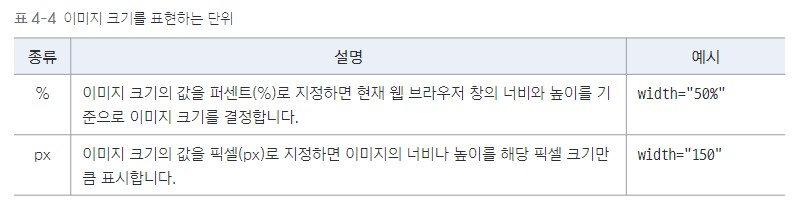

# 이미지 삽입하기
## 이미지를 삽입하는 ``````태그
```html

```
``````태그의 속성: src, alt<br>
<u>src 속성</u>: 이미지 파일의 경로를 지정<br>
<u>alt 속성</u>: 화면 낭독기 등에서 이미지를 대신해서 읽어 줄 텍스트를 입력
```html

<h1>레드향</h1>
```
### 이미지 파일 경로를 나타내는 src속성
경로 입력에 유의해야 함<br>
같은 경로에 있다면 이미지 파일의 이름만 적어도 됌
하위 폴더에 있다면 하위 폴더와 함께 이름 적어줘야됨
### 이미지를 텍스트로 대신 설명하는 alt속성
인터넷이 불안정하거나 파일 경로를 잘못 넣는 등 이미지를 제대로 표시 할 수 없는 경우에 이미지 대신 텍스트가 나타남<br>
### 이미지 크기를 조절하는 width, height속성
이미지의 width<sup>너비</sup> height<sup>높이</sup>를 정함<br>
둘중 하나만 사용해도 비율을 자동으로 계산하여 나타냄<br>
사용할 수 있는 단위는 퍼센트<sub>%</sub>와 픽셀<sub>px</sub>이 있음<br>
픽셀<sub>px</sub>을 사용할 때는 ~~단위를 쓰지 않고~~ **숫자**만 입력<br>
<br>
